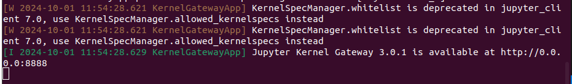

# Proof-Of-Concept for Jupyter Remote Kernels

## Repo Structure
```
|- client.py # client code that requests the kernel and offload the workload to a remote kernel
|- cudacoda.py # simple cuda code which will send some data to gpu as well.
```

## Running the code
### Edge Device
The edge we tested on is Jetson Orin Nano
```
pip3 install jupyter_kernel_gateway
```
```jupyter_kernel_gateway``` is a headless webserver that provides headless access to jupyter kernels. For more information visit <a href="https://jupyter-kernel-gateway.readthedocs.io/en/latest/index.html">here</a>.
Next we will create a virtual environment
```
pip3 install virtualenv # install virtual environemt
python3 -m venv test_ # create a virtual environment
source test_/bin/activate # activate the virtual environment
pip3 install pycuda # install pycuda(useful for this example)
```

Next, we will start the jupyter_kernel_gateway
```
python3 -m ipykernel install --user --name=test_
jupyter kernelgateway --KernelGatewayApp.ip='0.0.0.0' --KernelGatewayApp.port=8888 --KernelSpecManager.whitelist=["Python test_"]
```
The last command will create the jupyter server for you at port 8888, see 

</img>

## Client Device
Connect your client device(I used Ubuntu OS 22.04) with type-c connector with the Jetson.
Note, if you are connected to Jetson via wireless network, you have to change the base url in the ```client.py``` file, else keep it as is.

Run the python file,
```
python3 client.py
```
In the output you have to wait for some seconds to see GPU activity. 

To close the client application press ```ctrl+c```.
To close the server in the edge press ```ctrl+\``` or ```ctrl+c``` then type ```y```, this will close all the kernels in that session.

## Notes:
The ```cudacode.py``` is a basic pycuda code. We can change the code to offload more complex codes as well. 